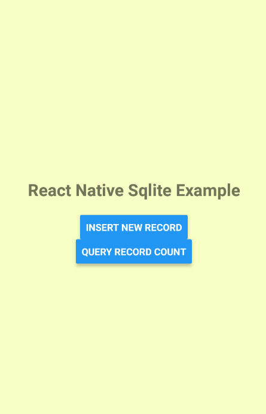

# React Native SQLite Example

```
本例子展示了在React Native下的SQLite数据库的使用，可以直接在代码内用JavaScript编写SQL语句的方式来建表结构，插入数据和查询记录等操作。

暂时仅在Android平台测试通过，iOS设备上尚未测试。

```

### 下载

下载或者克隆本git资源 https://github.com/amiku/ReactNativeSqliteExample.git

> $ git clone https://github.com/amiku/ReactNativeSqliteExample.git
>

### npm安装

参照如下的命令npm安装，并且直接打包在Android设备上

```
$ npm install
$ react-native run-android

```

### 截图
